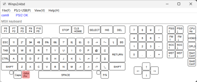
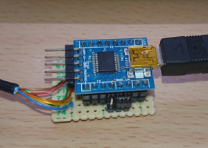

# PS2-VKBD & Winps2vkbd
2023/01/04 Harumakkin

## ■ Waht is this
- 通常はMSX2+互換機であるSX-2[^1]ではPS/2キーボードを接続して使用します。このPS2-VKBD & Winps2vkbdを使用すればPS/2キーボードの代わりにWindowsPC上からSX-2に対してキー入力を行えるようになります。SX-2だけを使用している場合はまったく利点はありませんが、WindowsPCを使用してMSX用のソフトウェアを開発しているなどの、SX-2とWindowsPCを同時に使用している場合に威力を発揮します。狭い机の上からSX-2を使用するためのPS/2キーボードを排除できます。
- PS2-VKBDは、SX-2とWindowsPCを接続するための一種のUSB-PS/2インターフェイス変換ケーブルです。
- Winps2vkbdは、WindowsPC上で動作するアプリケーションです。WindowsPCへのキー入力をSX-2へ送信します。また画面上に仮想キーボードとして表示されますのでマウスからのキー入力も可能にしています。

*fig.1 Winps2vkbd*

*fig.2 PS2-VKBD*

[^1]: 販売元 https://www.8bits4ever.net/msx ただしSX-2は、2023年1月現在、販売されていません

## ■ Get ready
### Winps2vkbd の準備
PS2-VKBDを製作します。回路図、部品表は下記を参照してください。また、PS2-VKBDはPIC18F14K50マイコンボードを使用しています。これにファームウェアを書き込むためにPICkit4等のプログラマー／MPLAB IPE が必要です。またそれらを扱うための知識も必要です。
- 部品表 ： docs/PS2-VKBD partslist.xlsx
- 回路図 ： docs/PS2-VKBD schematic.pdf
- 実装例 ： docs/PS2-VKBD example.pdf

## ■ 使い方
1. PS2-VKBD(ケーブル) のPS/2ケーブル側をSX-2へ接続し、USBケーブルでWindows PCへ接続します。
2. 問題なければデバイスマネージャーにCOMポートが追加されます。デバイスマネージャーを確認し、COM番号をメモしておきましょう。
3. Winps2vkbd.exe を実行します。キーボードを模したウィンドウが開きます[^2]。
4. Winps2vkbdのメニュー → PS/2-USB2 → COM ports から先ほどメモしたCOM番号を選んびます[^3]。
5. SX-2の電源を入れたとき、すべてが正常なら、Winps2vkbd の左上に
      COMxx OK   PS2 OK  と表示されます(xxは数字)。NGと表示される場合は、COMポートの選択、PS2-VKBD自体の確認を行ってください。
6. キーボードかWinps2vkbdのウィンドウ内のキーを直接クリックすることで、入力が行えます[^4]。

[^2]: ウィンドウが開かずランタイムライブラリを求められた場合は作業を中断し、マイクロソフトのサイトからランタイムライブラリをダウンロードしてインストールしてください。ランタイムライブラリ、ただしくは、”Visual Studio 2015、2017、および 2019 用 Microsoft Visual C++ 再頒布可能パッケージ”という、ここらへんから、vc_redist.x86.exeをダウンロード)

[^3]: Winps2vkbdのコマンドラインに COM番号を指定しておくこともできます。例) Winps2vkbd.exe COM12

[^4]: SX-2 側が日本語109キーボードに対応していることを想定しています。SX-2は出荷状態では英語キーボードですので、bootSDでDOSを起動し "setsmart /15" もしくは、"keubord /j"を実行して日本語キーボードに切り替えてください。

## ■ Winps2vkbd ver0.9.1 現状の制限
- CTRL+SHIFTを押しつつESCを押すとタスクマネージャーが起動する。このタスクマネージャーが開いた後にCTRL、SHIFT、ESCを離してもCTRL、SHIFTキーは解放されない。Winsp2vkbdはキー押下中にフォーカスを奪われてもキー開放を行えるようにグローバルフックを使用してキー入力を検出しているが、タスクマネージャーにフォーカスがある場合グローバルフックではキー入力が止まってしまうようである。これは恒久的な制限になるかもしれない

## ■ PS2-VKBD(PIC18F14K50 firmware) 更新履歴
#### v1.1(20230104)
- PS2-VKBD: SX-2(OCM-PLD)のファームウェアバージョンが 3.8.2 ではただ引く動作しますが、3.9.0 以降であった場合、全く使用できない不具合がありました。PS/2プロトコルの扱いに間違いあったのでそれを修正し、SX-2(OCM-PLD) version 3.9.0、3.9.1、3.9.2(仮)で正しく動作するように改善しました。
#### v1.0(20210909)
- DE0＋DEOCMでは、キーが押しっぱなしになる不具合あり。PS/2端子へ出力している波形を観測したら、DATAラインの変更タイミングからCLOCKラインの変更までに時間的に余裕が無く、また、Breakコードの２バイト目が１バイト目から間隔をおかずに送信していた。これにより本体側がBreakコードを正しく受信できていなかったためと推測し、CLOCKラインの変更のタイミングに余裕を持たせ、また、Breakコードの１バイト目から２バイト目を送信すいるまでの2msの間隔を置くようにした(PS/2キーボードを参考にした)。
- DE0＋DEOCM (ファームウェア2017年3月26日) での動作確認していただきました。※ほくとさん(@NightBird_hoku)ありがとうございます。
- SX-2 (OCM-PLD version 3.9 by KdL) での動作もOKです。
#### v0.9(20210821)
- 初リリース

## ■ Winps2vkbd 更新履歴
#### ver1.0.0
- new: メニューを英語化しView項目を追加した
- bugfix: CAPS LOCKなどのLEDが正しく転倒しないことがある不具合を修正した
- new: COM Port listの文字を大きくし、またダブルクリックで選択できるようにして使いやすくした 
- new: capsとかなキーの近くにインジケーター表示を設けた
- bugfix: PowerToysで位置を入れ替えたキーの押下を正しく判断できない不具合を修正した
#### ver0.9.2
- bugfix: USBケーブルがPCから抜け、再度接続されたときにCOMの状態が復元しなかった不具合を改善した
#### ver0.9.1
- ver0.9.0 では対応していなかったMSX Keybord 上のボタン[PSG↑][PSG↓][FM↑][SCC↑][Slot1Conf][Slot2Conf]に対応しました。
- ウィンドウ内のキーをマウス押下しながらウィンドウ外へ移動し、マウスボタンを解放すると、キーが押しっぱなしになる不具合を修正した。マウスキャプチャの方法を間違えていたのが原因でした
- ウィンドウ内のキーを押下中に補完おアプリケーションにフォーカスを奪われたら、押下していたキーを強制的に解放するようにしました
#### ver0.9.0
- 初リリース

## ■ 製作の参考にしたサイト
製作にあたり以下のサイトの内容を参考にさせていただきました。PS2-VKBDに関してはこのサイトで紹介されている回路図をほぼそのまま利用させていただいています。

PS/2 に関する:
- https://miettal.hatenablog.com/entry/20120319/1332137072
- https://miettal.hatenablog.com/entry/20121120/1353413487
- http://www3.airnet.ne.jp/saka/hardware/keyboard/109scode.html

PIC18F14K50に関する：
- http://machoto2.g2.xrea.com/page/P14K50/P14_00.htm

仮想キーコードに関する：
- http://kts.sakaiweb.com/virtualkeycodes.html

### 本作品は同人ハードウェア＆ソフトウェアです
1. 本作品の設計およびソフトウェアは品質を保証していません。SX-2本体、WindowsPC本体が故障したとしても自身で責任を負える方のみ本作品をご利用ください。特にハードウェアの製作を伴いますのでリスクがあります。製作の腕に自身のある方のみご利用ください。
2. またPIC18F14K50のファームウェアは、Microchip Technology Inc.の公開している CDC RS-232 Emulation Demo のソースコードを使用しています。よって、USBのディスクリプタの情報はCDC RS-232 Emulation Demoのままです。商用利用する場合などは、Vender IDの取得が必要になります。
3. この1. 2.の内容により、ご自身で製作したものは自己責任において個人の範囲内でのみ利用してください。
4. 本作品の設計資料とソースコードの改変や改造、また、別の作品への利用、商用利用は自由です。ただし、1. 2.の制限を超える利用は各自でその責任と義務を負ってください。

